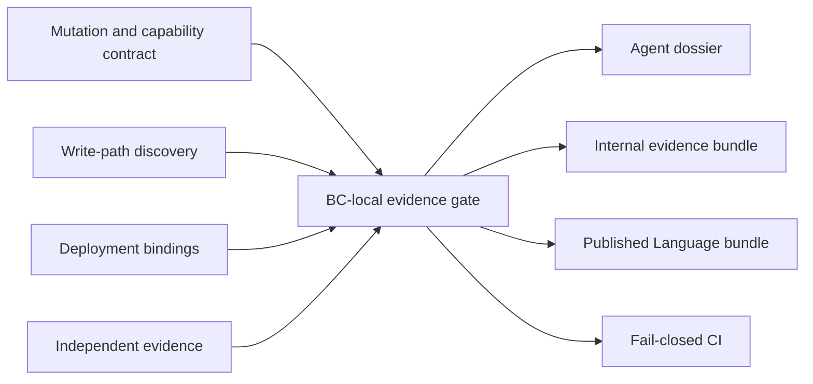

# Federated Consistency Evidence Gate

Status: accepted target architecture; not yet implemented.

## Purpose

The Consistency Evidence Gate makes it impossible to ship a durable mutation
without explicitly selecting, implementing, and testing its concurrency policy.
It is a build-time engineering capability. It is not a lock manager, transaction
engine, workflow runtime, or proof that a declared policy is semantically correct.

The gate composes proven runtime mechanisms such as database constraints,
compare-and-swap revisions, transactions, Temporal workflows, inbox/outbox,
leases with fencing, and idempotent external effects. It does not reimplement
those mechanisms.



## Ownership boundary

The foundation owns only reusable mechanisms:

- the language-neutral contract schema and strategy vocabulary;
- TypeScript write-path discovery and future language discovery adapters;
- contract, binding, evidence, and compatibility validators;
- generators, deterministic diagnostics, reports, and bundle formats;
- generic conformance scenario definitions and test harness adapters.

Each consumer owns its facts:

- bounded contexts, features, aggregates, invariants, and mutations;
- stable capability identities and conflict scopes;
- enabled deployment profiles and adapter bindings;
- semantic test oracles and project-specific conformance fixtures;
- Published Language, migrations, retention horizons, and ADRs.

Foundation code remains a development-only dependency. Generated reports and
bundles cannot require the foundation at product runtime.

## Agent-first interface

JSON Schema is an internal validation mechanism, not the primary human or agent
interface. The target non-interactive commands are:

```text
foundation context --changed [--format text|markdown|json]
foundation create:mutation <context>/<feature>/<mutation>
foundation consistency:list [--context <id>]
foundation consistency:check [--changed] [--explain]
foundation consistency:explain <capability-id> [--format text|markdown|json]
```

`context` and `consistency:explain` produce a bounded dossier containing:

- the owning context and feature;
- aggregate and invariant identities;
- conflicting mutations and allowed write ports;
- resolved local and hosted strategies;
- required evidence and its current status;
- exact source, contract, binding, and test paths;
- one root-cause diagnostic and a remediation command for each failure.

Interactive prompts are prohibited in CI and agent workflows. Generated indexes,
dossiers, and reports are disposable outputs and are never edited manually.

## Capability contract

Each durable mutation has one local contract beside its application handler. A
stable capability identity does not depend on a file path, package location,
deployment shape, or implementation language. Retired identities are reserved
and never reused.

```yaml
schemaVersion: 1
contextId: run-orchestration
capabilityId: run-orchestration.start-run
contractRevision: 1
kind: mutation
invariants:
  - run.single-active-admission
consistency:
  strategy: optimistic-revision
  scope: runId
idempotency:
  key: commandId
ambiguousOutcome:
  policy: reconcile
```

The contract references invariant identities; it does not copy their prose or
domain implementation. A consumer may choose YAML, JSON, or a typed source form
only when it compiles to the same language-neutral intermediate representation.

## Standard strategies

The initial vocabulary is intentionally small:

- `optimistic-revision`;
- `unique-admission`;
- `serialized-by-key`;
- `serializable-transaction`;
- `lease-with-fence`;
- `process-managed-reservation`;
- `custom`, which requires an accepted ADR and an independent conformance pack.

The strategy describes required semantics, not a vendor API. An adapter or
bounded-context profile maps a standard strategy once to its normal local and
hosted mechanism. Per-capability binding overrides are allowed only when the
default cannot prove the invariant. This prevents a SQLite/PostgreSQL mapping
from being copied into every mutation contract.

Examples of adapter mechanisms include SQLite single-writer transactions,
PostgreSQL conditional updates, unique constraints, row locks or serializable
transactions, Temporal workflow identity, and leases whose monotonic fence is
checked by the protected resource.

## Closed write-path coverage

The gate enforces relationships rather than a misleading literal equality of
sets:

1. every discovered durable write entry point belongs to exactly one mutation;
2. every mutation has exactly one consistency contract;
3. every enabled deployment profile resolves a compatible binding;
4. every selected strategy requires a defined evidence scenario set;
5. every required scenario has independent executable evidence at the required
   level.

Write-path discovery includes ordinary command handlers, process-manager
transitions, timers, schedules, Temporal signals or updates, repair commands,
administrative commands, inbox consumers, and post-commit effect dispatchers.
Migrations are governed separately and declare their affected capabilities.

Closed-world coverage also requires consumer architecture rules:

- only registered mutations receive a write-capable Unit of Work;
- queries receive a physically read-only context;
- raw database clients are confined to persistence adapters;
- inbound adapters do not import mutation handlers directly;
- dynamic mutation registration and untracked write aliases are prohibited;
- unknown write paths fail the complete repository check;
- affected execution may optimize expensive evidence, but never replaces the
  complete fast discovery gate.

The first implementation generates no production handler registry. A BC-local
runtime registry may be introduced only after repeated registration drift is
demonstrated and a separate ADR proves that generation reduces risk without
creating runtime coupling.

## Evidence levels

Contracts do not count as proof. Generated expected results from the same
contract also do not count as independent evidence.

The gate distinguishes at least:

- declaration validated;
- write-path coverage validated;
- semantic model evidence passed;
- local adapter evidence passed;
- hosted adapter evidence passed;
- fault and ambiguous-outcome evidence passed;
- workflow-history replay evidence passed, when applicable.

Required scenarios are derived from strategy, but assertions and semantic
oracles remain consumer-owned. Hosted evidence uses real infrastructure for
behaviors that an in-memory fake cannot prove, including serialization failures,
deadlocks, fencing, lost acknowledgement, redelivery, and multi-instance races.

## Federation and service extraction

The architecture is closed within a bounded context or independently deployed
service and open between services:

```text
Closed World inside one bounded context or service
Published Language between bounded contexts or services
```

Each context owns its registry or index, storage namespace, migrations, inbox,
outbox, bindings, evidence, and bundles. There is no global runtime handler
registry, shared mutex, shared inbox/outbox table, cross-context transaction, or
cross-context SQL. A read-only organization catalog may index published bundles
without becoming a runtime authority.

Cross-service invariants have one authoritative owner. Other services coordinate
through commands, reservations, idempotent messages, and process managers rather
than a distributed mutex. Extracting a context changes composition, transport,
and physical persistence; its domain model, application mutations, stable
capability identities, and consistency contracts remain.

The intermediate representation stays language-neutral. TypeScript discovery is
the first adapter; future Go or Rust services require language-specific discovery
that proves equivalent closed-world coverage.

## Compatibility and versioning

Do not collapse all compatibility into one version number. Track independently:

- implementation build;
- storage schema;
- wire contract;
- workflow history.

Rolling changes are additive first and use expand, migrate, contract sequencing.
Compatibility must cover the maximum of message retention, longest supported
workflow history, supported client lifetime, and rolling deployment duration.
Internal evidence bundles contain invariants, conflict scopes, bindings, and test
evidence. Published Language bundles contain only public schemas, fixtures,
capabilities, and compatibility metadata; SQL, locks, and private fences remain
internal.

## Implementation rollout

### Phase 1: minimal agent-first gate

Estimated size: 4k-8k lines including fixtures and tests.

- add the consistency capability to foundation configuration;
- implement one local contract format and language-neutral IR;
- discover TypeScript write paths under governed topology;
- support the initial standard strategies;
- resolve context/profile default bindings;
- implement `context`, `create:mutation`, `check`, and `explain`;
- emit deterministic text, Markdown, and JSON diagnostics;
- block missing contracts, bindings, and evidence declarations.

### Phase 2: executable evidence

Estimated additional size: 5k-10k lines.

- add semantic and model-based scenario packs;
- add SQLite and PostgreSQL real-adapter conformance;
- add retry, idempotency, lease/fence, inbox/outbox, and ambiguous-outcome tests;
- integrate fault injection without generating semantic expected results.

### Phase 3: service federation

Estimated additional size: 4k-8k lines.

- produce separate internal and Published Language bundles;
- add compatibility and mixed-version checks;
- add polyglot discovery adapter contracts;
- index independently built service bundles without central runtime coupling.

## Package placement

The first implementation remains inside the single public package:

```text
packages/engineering-foundation/src/capabilities/consistency/
```

It may become a separate workspace package only when independent consumers,
dependencies, or release lifecycle justify the split. The public meta-package and
consumer command surface must remain stable across that internal move.

## Rejected alternatives

- Build a custom lock manager, transaction engine, consensus protocol, test
  runner, or universal runtime concurrency DSL.
- Treat a manifest or generated test as proof of semantic correctness.
- Make Restate, Temporal, Dapr, Redis, etcd, PostgreSQL, or any other mechanism a
  mandatory core dependency; they remain possible deployment bindings.
- Generate one global handler registry or require all contexts to rebuild for one
  context change.
- Use process-local mutexes as hosted or multi-instance correctness mechanisms.
- Introduce production registry generation before real registration drift is
  demonstrated.
