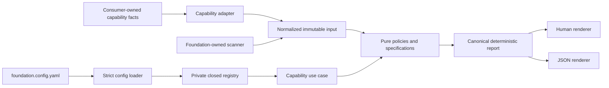

# Executable Capabilities

Status: Active for workspace declarations, source dependencies, suppression
governance, public API compatibility, and repository security.

ADR-0001 accepts this model. Version 0.2 replaces `foundation.config.mjs` with
strict `foundation.config.yaml` and implements the first capability. The source
dependency capability is implemented and dogfooded behind internal ports.
ADR-0002 accepts its Oxc adapter after cross-platform conformance evidence.
ADR-0003, ADR-0004, and ADR-0005 accept the three governance capabilities.
Package installation never activates them: the consumer declares each applicable
capability and supplies its own policy and qualification evidence.

## Goals

- one versioned implementation of reusable engineering policy;
- consumer-owned architecture facts and exceptions;
- deterministic output for CI, tools, and coding agents;
- feature-owned capability slices with strict dependency direction;
- internal implementation freedom without accidental public plugin contracts;
- an extraction path that proves semantic parity before deleting donor code.

## Non-goals

- a product runtime framework or dependency;
- a universal architecture DSL;
- a third-party plugin ecosystem;
- a replacement for package managers, compilers, Nx, or specialized linters;
- consumer business concepts, bounded-context catalogs, or authorization policy;
- affected-only checks as a substitute for complete CI coverage.

## Ownership and flow



Foundation owns loaders, scanners, normalized technical models, generic policy
evaluation, rule metadata, diagnostics, and rendering. A consumer owns package
identities, paths, roles, allowed edges, source roots, intentional exceptions,
and project-specific fixtures. Foundation must not contain names such as `Team`,
`Run`, a consumer's bounded-context roles, or a reserved organization scope.

## Capability boundaries

Capability identifiers describe one cohesive policy surface. They are not menu
categories.

### `workspace.dependency-declarations`

The first implementation validates declared workspace dependency state:

- workspace membership and unique package names;
- local package references through the package manager's workspace protocol;
- external dependency declarations through the accepted central version source;
- exact versions in the accepted catalog when consumer policy requires them;
- legal dependency sections and development-only tooling placement.

Version 1 supports pnpm through an internal adapter selected explicitly by the
capability configuration. The capability ID remains policy-oriented; support for
another package manager requires a proven second adapter, not speculative generic
interfaces in the public API.

### `architecture.source-dependencies`

The second implementation validates observed source relationships:

- package imports agree with declared and consumer-allowed edges;
- cross-package relative imports cannot bypass package boundaries;
- imported package subpaths are exported;
- unsupported or unresolvable governed imports fail closed.

The source scanner, resolver, source-tree reader, and workspace inventory sit
behind separate internal ports. Exact Oxc 0.142.0 is the accepted outbound parser
adapter after comparison with a TypeScript 6 oracle. Parser-native types never
cross into application policy or public contracts.

Documentation ownership, DDD feature layout, LikeC4, security classification,
reliability catalogs, and scaffolding are separate capabilities or remain local
consumer checks. They cannot be added to either dependency capability.

### Governance capabilities

- `quality.suppression-governance` owns exact temporary inline waivers;
- `package.public-api-compatibility` owns released TypeScript API evidence,
  Changeset classification, and breaking-change approval;
- `repository.security-baseline` owns workflow least privilege, immutable action
  references, dependency/SBOM gates, and static publishable-package metadata for
  repositories that publish packages. Real tarball qualification is a separate
  consumer publication gate.

Each remains an independent feature slice with its own model, ports, policies,
adapters, schema, rules, and fixtures.

## Internal package shape

Capabilities remain feature-owned inside the existing public package:

```text
src/
  composition/
    capability-registry.ts
  capabilities/
    workspace-dependency-declarations/
      contract/
      application/
        model/
        policies/
        ports/
      adapters/
        inbound/cli/
        outbound/config/
        outbound/pnpm-workspace/
      testing/
      module.ts
    source-dependencies/
      contract/
      application/
        model/
        policies/
        ports/
        use-cases/
      adapters/outbound/
      module.ts
  workspace-inventory/
    application/
    adapters/outbound/
```

Do not create a large shared `capability-runtime` hierarchy before a second
capability proves what is genuinely common. Minimal report and invocation types
may live in a small internal module. A capability becomes a separate workspace
package only when independent dependencies, consumers, or release cadence prove
the need.

## Configuration contract

The target root is `foundation.config.yaml`:

```yaml
schemaVersion: 1
project:
  id: consumer-repository
capabilities:
  workspace.dependency-declarations:
    configPath: architecture/foundation/dependency-declarations.yaml
```

Configuration rules:

- capability presence means enabled; disabled placeholders are prohibited;
- root and capability schemas are versioned independently;
- JSON Schema Draft 2020-12 is canonical and every object closes unknown
  properties;
- duplicate YAML keys, aliases, merge keys, custom tags, and environment
  interpolation are prohibited;
- config paths use repository-relative POSIX syntax and cannot be absolute,
  contain `..` or backslashes, or escape through a symlink;
- capability configuration is data, never executable consumer code;
- configuration loaders resolve paths from an explicit consumer root, never an
  ambient or hosting-wide working directory.

The exact dependency-declaration schema is an implementation deliverable. It
must separate package-manager input from consumer policy rather than expose pnpm
objects as domain models.

Schemas are the single source for public data shape. Loaders validate unknown
input against the schema before explicitly mapping it into a capability-owned
normalized internal model. Internal models are not hand-maintained mirrors of the
wire shape. The package ships immutable versioned files, conceptually:

```text
schemas/
  foundation-config/v1.schema.json
  foundation-check-report/v1.schema.json
  workspace-dependency-declarations/v1.schema.json
```

Explicit package exports and `agent-teams-foundation schema <schema-id>` expose
the same files. Any future public TypeScript contract types must be generated or
mechanically proven against those schemas; independently maintained duplicate
wire types are not allowed. A convenient unversioned alias may exist for humans,
but committed consumer configuration references a versioned schema.

## Public report contract

JSON is the canonical result. Text output renders the same report and cannot
invent separate state. The command always returns one aggregate report, even
when the caller selects only one capability. This avoids a future output-shape
change when repositories enable multiple capabilities.

```text
FoundationCheckReport
  reportSchemaVersion
  foundationVersion
  coverage: full
  outcome: passed | violations | invalid-input | failed | cancelled
  summary
  capabilities[]
  problem?

CapabilityReport
  capabilityId
  capabilityConfigSchemaVersion
  outcome: passed | violations | invalid-input | failed | cancelled
  summary
  diagnostics[]
  problem?
```

Summary objects contain explicit counts by outcome and severity. An execution
problem contains a stable code, bounded safe message, phase, and retryable flag;
it never substitutes for a policy diagnostic.

Each diagnostic contains:

```text
ruleId
severity
subject
message
location: repository-relative POSIX path and optional 1-based range
relatedLocations[]
evidence
remediation
requiresArchitectureReview
```

`ruleId` is stable and semantic, for example
`workspace.dependency-declarations.external-version-not-cataloged`. An ID is
retired rather than reused with different meaning. `subject` identifies the
violated semantic object without depending on an absolute line number, enabling
stable parity comparison and future versioned fingerprints. Human wording may
improve without changing rule identity.

Capability reports sort by capability ID and diagnostics sort by rule ID,
semantic subject, path, and range. Configuration declaration order and I/O
scheduling cannot change output. Reports contain no timestamps, absolute paths,
stack traces, credentials, raw environment values, or unbounded source excerpts.
JSON mode writes one aggregate report to stdout; incidental logging cannot
corrupt the stream.

Each rule's ID and metadata are declared once in its owning capability. The same
registry powers diagnostics, generated reference material, and:

```text
agent-teams-foundation explain <rule-id> --format text|json
```

Rule metadata includes rationale, default severity, remediation guidance, and
the authoritative documentation location. Consumer configuration cannot silently
downgrade a blocking rule.

## Invocation and failure semantics

```text
agent-teams-foundation check
agent-teams-foundation check workspace.dependency-declarations
```

Exit codes are stable:

- `0`: all selected capabilities passed;
- `1`: policy violations were found;
- `2`: invocation, configuration, or governed input is invalid;
- `3`: environment or internal execution failed;
- `130`: execution was cancelled.

Aggregate precedence is cancellation, internal failure, invalid input, policy
violation, then success. Cancellation returns `130`; otherwise any internal
failure returns `3`, any invalid input returns `2`, and any violation returns `1`.
The aggregate outcome follows the same precedence.

Invalid or unreadable governed input never becomes a partial success. The root
configuration is validated before capability execution. Policy evaluation
collects all bounded diagnostics instead of failing on the first violation.
After valid root configuration, independent declared capabilities continue when
one capability reports violations or capability-local invalid input. Capabilities
cannot consume another capability's report or rely on incidental execution order.
A shared read-only snapshot may be extracted internally only after repeated
parsing cost or drift is measured.

Normal capability checks are read-only and use no network, shell, or subprocess.
The explicit release-only API baseline promotion command is the sole write path;
it performs an atomic adapter-local replacement after release evidence passes.
Checks accept `AbortSignal`, bound input, reject path ambiguity, and sort results
independently of scheduling. Linux and Windows behavior must match.

## Exceptions and suppressions

Inline suppression governance is active. Its exact waiver contract and
non-waivable rule classes are defined in
[Suppression governance](suppression-governance.md). Capability diagnostics have
no inline suppression mechanism.

## Compatibility and release policy

These versions are independent:

- npm package version;
- root configuration schema version;
- capability configuration schema version;
- report schema version;
- versioned diagnostic fingerprint algorithm, when introduced.

Exact consumer dependency pins make upgrades explicit. Patches preserve schema
and rule meaning. New capabilities or rules require an upgrade note and
conformance evidence. A breaking schema publishes a new schema version and a
migration guide; existing immutable schemas remain available for the supported
migration window.

Before version 1.0, an intentional public breaking change increments the minor
version. After version 1.0 it increments the major version. Stable rule IDs are
not changed merely to fit package SemVer.

## Extraction and conformance

The first capability follows this sequence:

1. define strict schemas, report fixtures, rule metadata, and adversarial
   positive and negative repositories;
2. implement pure policies and capability-specific adapters;
3. run the foundation validator and donor validator in advisory dual-run mode;
4. compare normalized `ruleId + subject + location`, never rendered strings;
5. prove parity on materialized fixtures and a real consumer;
6. make the foundation capability blocking while retaining the donor oracle for
   a short observation window;
7. delete only the superseded donor rules, leaving consumer-specific topology
   validation local;
8. pass package tarball, public registry, local attach/detach, Windows, Linux, and
   consumer conformance checks;
9. publish version 0.2 only after registry installation reproduces the same
   result.

A green run against the current orchestrator alone is insufficient because its
package catalog is largely reserved and does not yet materialize the future
product graph.

## Deferred work

- affected execution, persistent cache, and watch mode;
- SARIF conversion and versioned partial fingerprints;
- autofix and scaffolding;
- public programmatic evaluation API;
- dynamic or third-party capabilities;
- generated production registries.

The JSON report keeps future SARIF conversion possible: SARIF requires stable
rule identifiers and recommends versioned partial fingerprints that avoid
absolute line numbers. The native foundation report remains smaller and
agent-oriented until a real SARIF consumer exists.

## External standards

- [JSON Schema Draft 2020-12](https://json-schema.org/draft/2020-12)
- [SARIF 2.1.0](https://docs.oasis-open.org/sarif/sarif/v2.1.0/sarif-v2.1.0.html)
- [pnpm catalogs](https://pnpm.io/catalogs)
- [pnpm workspace protocol](https://pnpm.io/workspaces#workspace-protocol-workspace)
