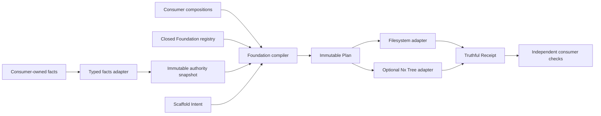

# Scaffolding Compiler Protocol

Status: Active for the protocol kernel, testing conformance vertical, and generic
Node TypeScript library-boundary recipe.

[ADR-0006](../decisions/0006-closed-deterministic-scaffolding-compiler.md)
accepts this design. The canonical source-bound protocol, public schemas, CLI,
programmatic API, journaled filesystem adapter, testing-only conformance
definitions, and the first generic technical Recipe are implemented. Foundation
exposes no parallel legacy API. Structured-update operations, a second consumer,
and the Nx adapter are not implemented or qualified.

## Implementation status

The testing vertical proves the execution protocol without inventing consumer
business architecture. The generic `foundation.node-typescript-library-boundary`
Recipe materializes only a private composite TypeScript package envelope. It is
not a bounded-context, application, or feature Recipe. Consumer Compositions
retain all role admission, path, package-name, and owner-document decisions.

Available commands:

```bash
agent-teams-foundation scaffold-plan intents/example.yaml --consumer /repo --json
agent-teams-foundation scaffold-apply plans/example.json --consumer /repo --json
agent-teams-foundation scaffold-recover --consumer /repo --json
```

`scaffold-plan` reads the strict consumer configuration at
`architecture/foundation/scaffolding.yaml` by default. `--config` may select a
different repository-relative file. Apply executes only the exact final bytes
in a saved immutable Plan. Before writing, it independently recompiles the
expected Plan from the embedded normalized Intent and current consumer authority
and requires an exact digest match.
The target catalog stores one owner document ID, not a duplicated path. The
selected Composition declares bounded `documentRoots`; Foundation resolves the
ID exactly once from strict Markdown frontmatter and records the derived path and
selected document digest in the Plan. Only the `id` and `status` frontmatter
projection is authoritative to Foundation. Consumer-specific metadata remains
owned by the consumer documentation system. Traversal has fixed entry, document,
and directory-depth budgets.
One authority verification reads all three canonical sources, then repeats
their digest reads. A persistent mutation during acquisition fails closed. This
is a stability protocol under the cooperative repository lock, not an atomic
snapshot against a non-cooperating editor.
Recovery applies the same proof before it resumes a prepared journal. If the
current authority is unavailable or cannot reproduce the journal Plan exactly,
recovery fails without changing the journal or its outputs. The portable
filesystem adapter never deletes output after publication begins: journal state,
process-local observation, and matching bytes cannot prove that a path was not
replaced by another writer.

The programmatic recovery API also accepts an optional closed
`ScaffoldRecoveryScope`. Foundation snapshots and validates its exact project,
configuration path, target-catalog path, and Composition ID before asynchronous
work. After canonical-root resolution and cooperative lease acquisition, the
Node adapter compares those portable strings with the single stored journal
record that it continues. A mismatch retains the transaction barrier and occurs
before authority reads, output classification, journal replacement, or
publication. The one-argument API and `scaffold-recover` CLI retain their
existing behavior; the overload adds caller-to-journal binding without changing
the journal or Plan protocols.

## Goals

- one deterministic scaffolding protocol for multiple repositories and tools;
- reusable technical recipes without copying consumer business architecture;
- safe, idempotent operation for coding agents and CI;
- exact previews and actionable machine-readable diagnostics;
- framework-neutral execution with optional Nx integration;
- incremental support for backend, frontend, Electron, SDK, infrastructure,
  testing, and future non-TypeScript workspaces;
- a stable evolution path for definitions and migrations.

## Non-goals

- a universal architecture or filesystem DSL;
- a product runtime framework or production dependency;
- generation of aggregates, entities, policies, or other business meaning;
- empty DDD layers or placeholder source presented as an accepted feature;
- a public third-party recipe, facet, template, or policy plugin ecosystem;
- remote templates, executable consumer configuration, or package installation;
- true multi-file filesystem atomicity;
- replacing Nx, package managers, compilers, formatters, or consumer validators.

## Vocabulary

The vocabulary is intentionally precise because `profile` and `preset` already
have other meanings across Agent Teams systems.

| Concept | Responsibility | Must not own |
| --- | --- | --- |
| `ScaffoldProfile` | One resolved technical environment such as language, module system, package manager, and framework boundary | Business topology, creation intent, deployment behavior |
| `Recipe` | One creation intent and its typed composition slots | Repository-wide defaults or unrelated optional concerns |
| `Facet` | One optional orthogonal contribution through recipe-declared slots | Arbitrary mutation, precedence, or implicit activation |
| `Composition` | Consumer-approved binding of profile, recipe, exact facet policy, parameters, and mandatory policies | New renderers or merge semantics |
| `Policy` | Blocking invariant over Intent, authority snapshot, Plan, workspace state, or Receipt | Defaults, generated files, or bypass switches |
| `Template` | Private pure renderer used by one released definition | Public selection, inheritance, policy, or runtime execution |
| `Preset` | Published static tool configuration such as TypeScript or Oxlint settings | Scaffolding composition semantics |

Use `ScaffoldProfile` in schemas and code. Bare `Profile` is too ambiguous with
deployment and runtime profiles.

## Ownership



Foundation owns:

- strict public schemas and canonicalization;
- normalization, composition, diagnostics, hashing, and policy phases;
- the static definition registry and proven generic definitions;
- workspace ports, filesystem application, journaling, and recovery semantics;
- conformance fixtures and adapter parity tests.

A consumer owns:

- package and target catalogs, including the package-to-owner-document ID;
- bounded contexts, feature ownership, terminology, and accepted evidence;
- local `ScaffoldProfile` bindings, approved `Composition` records, and bounded
  authority document roots;
- fixed/default parameters and additional monotonic policies;
- the final review and implementation of business behavior.

The optional Nx package owns only Nx `Tree` snapshot and apply translation. Nx
metadata is derived evidence and never another package or architecture catalog.

## Composition model

One Intent selects exactly one consumer-approved `Composition`. A Composition
resolves exactly one `ScaffoldProfile` and one `Recipe`. Facets are an
order-independent set constrained by the Composition.

Illustrative consumer configuration:

```yaml
schemaVersion: 1
projectId: agent-teams-orchestrator

sources:
  packageCatalog:
    format: agent-teams.package-catalog/v1
    path: architecture/package-catalog.yaml

scaffoldProfiles:
  orchestrator.typescript-context/v1:
    uses: agent-teams.typescript-package/v1
    fixedParameters:
      packageManager: pnpm
      moduleSystem: esm
    defaultParameters:
      tsconfigBase: tsconfig.json

compositions:
  context-first-slice/v1:
    scaffoldProfile: orchestrator.typescript-context/v1
    recipe: package-with-first-slice/v1
    targetRoles: [bounded-context]
    facets:
      fixed: [feature-owned/v1]
      allowed: [node-tests/v1, public-exports/v1]
      default: [node-tests/v1]
    policies:
      - catalog-target/v1
      - accepted-owner/v1
```

The identifiers are illustrative until a vertical slice accepts their exact
contracts. Consumer files refer to catalogs and evidence; they do not duplicate
resolved package paths, names, roles, or owner status.

### Parameters

- Profile, Recipe, and each Facet own separate closed parameter namespaces.
- Definition defaults apply first, then consumer defaults, then explicit Intent
  values.
- Consumer fixed parameters cannot be overridden.
- Unknown parameters and missing required parameters are invalid input.
- An Intent cannot supply output paths, templates, file content, policy
  exclusions, callbacks, or commands.

### Facets

- Facet declaration order has no semantic meaning.
- `requires` and `conflicts` are explicit versioned metadata.
- A required Facet is never silently enabled. Default and fixed expansion is
  visible in the normalized Plan.
- One file path has one base producer. Multiple byte-identical claims may
  deduplicate only when the relevant definition contract explicitly permits it.
- Structured contributions merge by stable semantic key through a
  Foundation-owned codec. Unequal duplicate keys, ordering cycles, and
  unsupported collisions fail.
- Last-write-wins, numeric priority, deep object overlays, and free-form text
  patches are prohibited.

### Policies

Policies are monotonic. Kernel, Profile, Recipe, Facet, and consumer policies are
unioned. A consumer may add or strengthen a policy but cannot remove, reorder,
downgrade, or suppress a stronger policy required by a selected definition.

## Public protocol

JSON Schema Draft 2020-12 is canonical. `Intent`, `Plan`, `Receipt`, and each
component parameter contract have independent immutable schema versions. Every
object closes unknown properties.

### Intent

An Intent contains:

```text
schemaVersion
compositionId
targetRef
normalized user parameters
explicit optional Facets
```

`targetRef` is a consumer catalog identity, never an arbitrary filesystem path.
The consumer adapter resolves it into an immutable authority snapshot before
compilation.

### Plan

A Plan contains:

```text
schemaVersion
compiler identity and version
consumer authority source paths
normalized source Intent
Intent digest
authority snapshot digest
definition identities, contract versions, and contract digests
normalized selection, resolved parameters, and passed policy evidence
complete read set and preconditions
required adapter capabilities
operations with exact final bytes, modes, and result digests
stable diagnostics
Plan digest
```

The Plan stores final bytes, not template references, AST callbacks, patch
functions, or formatter instructions. Apply never renders output from a newly
compiled Plan. It recompiles only as an authority proof and rejects the supplied
Plan unless the installed exact Foundation version and closed registry produce
the same digest from current facts.

A definition `contractDigest` covers its closed declarative contract. The
compiler package version identifies the released executable implementation, and
the operation digests bind the actual output bytes. A consumer cannot provide
or replace executable definition behavior.

Canonical JSON uses the NFC-normalized, safe-integer subset of RFC 8785 JCS and
SHA-256 digests. Semantic sets are sorted before canonicalization; genuinely
ordered collections remain ordered. Digested documents omit their own digest
field. Timestamps, absolute paths, locale-dependent values, environment data,
randomness, and secrets are absent.

### Receipt

A Receipt contains:

```text
schemaVersion
Plan digest
adapter identity and contract version
outcome
commit and recovery classification
per-operation precondition outcome and result digest
stable diagnostics
Receipt digest
```

Receipt outcomes distinguish at least:

```text
applied
already-applied
authority-stale
rejected
failed-recovered
recovery-required
```

An operation with `not-applied`, `conflict`, or `unobserved` has no result
digest. `unobserved` means the adapter intentionally made no safe filesystem
classification, so it cannot truthfully claim that the operation was absent.
Receipts do not claim a desired post-image that was not observed or published.
`failed-recovered` means a prepared transaction was finalized through the
recovery path. It may contain only `already-satisfied` operations when the crash
happened after every output was published but before the journal was removed;
`recovered` is used only for an output actually published during recovery.

The public Receipt is filesystem-only. The internal memory workspace is retained
only as rendering-kernel regression evidence and is not a supported consumer
adapter. The filesystem adapter reports journaled recoverability. The Nx adapter reports
host-managed commit semantics and cannot claim Foundation-owned durable recovery.

## Compilation and apply

The compiler is pure over the Intent, authority snapshot, registry definitions,
and immutable workspace snapshot. It reads no ambient working directory, clock,
randomness, process environment, network, or mutable global registry.

Before applying, an authority-bearing durable adapter must:

1. verify schemas, Plan and operation digests, and required capabilities;
2. acquire the repository-scoped cooperative mutation lock;
3. recompile any nonterminal Foundation journal from its embedded Intent and
   current consumer authority before it can publish or recover output;
4. preserve that journal and its outputs unchanged when this provenance cannot
   be proven;
5. reconcile only a journal whose exact Plan is reproduced by the closed
   compiler;
6. recheck the authority read set and compile the exact expected Plan with the
   installed compiler version from the embedded Intent, current consumer
   configuration, current catalog, and closed registry;
7. reject the supplied Plan unless that expected Plan has the same digest;
8. recheck every operation precondition;
9. reject path traversal, symlink or reparse escape, case-fold collision,
   protected roots, special files, and unsafe modes;
10. recognize an exact desired post-image as idempotently satisfied;
11. reject any third state rather than overwrite it;
12. verify the complete authority source set and classify every output;
13. repeat authority verification and output classification (`A-C-A-C`);
14. treat completion of the second output classification as the commit boundary
    within the cooperative mutation model;
15. only then remove the journal and emit a committed Receipt. If authority is
    stale or unverifiable, preserve every output and the journal.

The internal in-memory workspace is a non-durable conformance tool without
an external consumer authority boundary. It validates the self-contained Plan
and adapter capabilities; the durable filesystem adapter additionally performs
steps 2-15.

The current protocol materializes files only. It has no delete, move, fuzzy patch, wildcard
precondition, or overwrite-any-state operation. Updates to existing structured
documents require a later proven operation contract. Such updates compile to
exact post-images and CAS preconditions; Apply still performs no parsing.

For filesystem execution, a durable journal records preconditions and final
images before publication. Writes use same-directory temporary files, digest
verification, portable file-identity checks, and deterministic order. Cleanup
preserves a temporary path whose identity no longer matches Foundation's open
handle. A process crash may leave partial files until mandatory recovery; the
system does not claim true multi-file atomicity.
Recovery first reloads the journal's consumer authority and must reproduce the
exact Plan through the closed compiler. If it cannot, the journal and outputs
remain untouched. Recovery never overwrites a third-party edit that no longer
matches the planned post-image.

## Security boundary

Scaffolding is a trusted development tool operating on untrusted repository
state. The current protocol permits no:

- network access or remote assets;
- environment interpolation or implicit `cwd`;
- shell commands, package installation, or lifecycle scripts;
- consumer JavaScript, dynamic imports, callbacks, or executable hooks;
- public template inheritance, includes, helpers, or arbitrary template paths;
- `--force`, `--skip-architecture`, silent fallback, or policy suppression;
- writes outside the explicit repository root or approved target scope.

The cooperative lock is not a sandbox against a hostile process with the same OS
identity. CAS, path containment, and recovery protect correctness against normal
concurrent tools, crashes, and stale Plans. A stronger hostile-writer model
requires a separate threat-model decision and a platform adapter with
descriptor-relative filesystem primitives unavailable in the portable Node.js
API. Current conformance covers pre-existing symlinks or reparse paths and
cooperative concurrent writers, not adversarial same-identity ancestor swaps.
Scoped recovery does not widen that claim: it adds a cooperative caller-to-record
check and reuses the existing journal-store identity fence rather than adding a
descriptor-relative filesystem protocol.
All Foundation-aware automated writers of authority sources and scaffold outputs
must acquire the same repository Foundation operation lock. `A-C-A-C` is
stability evidence inside that cooperative model; it is not an atomic snapshot
or fencing protocol for an uncooperative writer.

## Applicability

The protocol is universal; project concepts are not. Profiles and proven
definitions can support different shapes without forcing one architecture:

| Consumer shape | Possible profile-owned behavior |
| --- | --- |
| Complex bounded context | Real feature slice with selected domain, application, process, persistence, contract, and test Facets |
| SDK | Contract, client, mapping, export, and conformance Facets; domain Facet prohibited |
| Integration adapter | External contract plus consumer-owned port and mapping; no invented domain model |
| Electron feature | Explicit shared, main, preload, renderer, IPC, and test placement as required by that consumer |
| CLI or application host | Thin command and composition output; business behavior and repositories prohibited |
| Platform tooling | Development-only capability, schema, CLI adapter, and fixture output |
| Tests | Colocated or dedicated conformance output according to consumer policy |
| Rust component | Future Cargo-aware Profile and codecs over the same language-neutral Plan |

Full DDD is therefore a consumer-selected, evidence-backed composition for
complex business contexts, not a default hidden in the compiler.

## Package boundary

The first implementation remains a feature inside
`@agent-teams/engineering-foundation`. Splitting contracts, kernel, definitions,
and adapters into several packages before independent consumers or dependency
lifecycles require it would add release and local-link complexity without a real
boundary.

Nx integration is the exception because `@nx/devkit` is an independent optional
dependency. When implemented, `@agent-teams/engineering-foundation-nx` uses an
evidence-backed peer range while each tested workspace pins one exact Nx version.
The adapter and Foundation kernel initially release as one Changesets fixed group.

## Delivery stages

These are qualification stages, not a requirement to prebuild every definition.
Stage 0 and the Foundation-owned implementation part of Stage 1 are complete.
The consumer repository owns donor parity and qualification evidence. A second
consumer and Nx remain later gates.

### Stage 0: protocol kernel and testing conformance

- publish the target ADR, closed schemas, CLI, and programmatic API;
- define canonicalization, diagnostics, policy union, definition compatibility,
  and capability negotiation;
- build the pure compiler, strict in-memory adapter, filesystem apply, lock,
  CAS, journal, recovery, and adversarial fixtures;
- provide a golden Intent, Plan, and Receipt vector for the testing-only
  conformance Composition;
- document anticipated backend, SDK, integration, Electron, tooling, and
  Rust-shaped applicability without publishing speculative definitions.

### Stage 1: first proven product vertical

- use the real Orchestrator package generator as the mandatory first donor. No
  product Recipe is accepted before this migration completes;
- keep the Orchestrator generator temporarily as a regression oracle, run both
  implementations from identical consumer-owned inputs, and compare normalized
  Plans and generated bytes across positive, conflict, replay, and recovery
  scenarios;
- make the Foundation source-bound generator authoritative only after parity and
  consumer qualification pass, then remove the Orchestrator-local compiler and
  retain only Orchestrator-owned catalog, Composition, target admission, and
  business-specific data;
- distinguish a Foundation Receipt, which proves materialized bytes, from
  consumer qualification, which proves that the completed real package passes
  its architecture, type, lint, and test gates;
- release the first product Recipe without product Facets. Before any product
  Facet is admitted, a versioned definition contract must constrain it to
  Recipe-declared typed slots instead of arbitrary file contributions;
- keep consumer target-role admission in the consumer Composition. The immutable
  internal testing Recipe retains its existing `allowedTargetRoles` contract,
  but no product Recipe may copy consumer business-role vocabulary into
  Foundation;
- provide the verified owner document ID to the product Recipe from the resolved
  authority target. The Recipe must not accept a second owner parameter or
  derive ownership from a path;
- migrate the Orchestrator catalog and schema to the canonical catalog contract
  in the same reviewed cutover. Preserve Orchestrator document-ID grammar,
  including existing uppercase ADR identities;
- keep complete Orchestrator topology admission and post-generation checks in
  the consumer. Foundation does not absorb business roles, path policy, package
  dependency policy, or accepted feature-document rules;
- preserve the mandatory Plan review boundary. The old one-shot command may be
  retained only as a donor oracle and cannot silently plan and apply through the
  new protocol;
- encode only the reusable Profile, Recipe, and Policies proven by that donor;
  add Facets later only after both the slot contract and a real donor prove them;
- compare normalized donor and Foundation Plans in dual-run mode.

The existing Orchestrator package-only scaffolder is the mandatory donor and
regression oracle, but does not become a reusable Recipe merely by being moved.
Only behavior proven generic by the migration may enter Foundation; the real
feature and consumer-owned architecture gates remain the qualification subject.

Foundation now implements the generic library-boundary Recipe and varied
synthetic fixtures. Stage 1 becomes Orchestrator-qualified only when the
Orchestrator repository records byte parity, recovery, and post-Apply consumer
checks against its real donor and removes the donor implementation.

### Stage 2: second consumer

- prove the same protocol against a materially different Platform or Agent
  Runtime vertical;
- extract only definitions that remain genuinely reusable;
- keep consumer-specific topology and policies local.

### Stage 3: Nx adapter

- publish the separate optional adapter only after memory and filesystem
  semantics are stable;
- prove byte-for-byte Plan parity and explicit host-managed Receipt semantics;
- prohibit Nx formatters, installers, or generators from changing bytes after
  Plan hashing.

### Stage 4: expansion and migration

- add backend, SDK, integration, Electron, application-host, and test definitions
  one accepted vertical at a time;
- add Rust/Cargo support only after real cases prove the codecs and workspace
  boundary;
- keep scaffolding replay separate from migration;
- introduce replace, move, delete, reconcile, or public extension contracts only
  through later evidence and, where semantics change, a new ADR or protocol
  version.

## Conformance

Every released vertical or adapter must cover:

- strict-schema positive and adversarial fixtures;
- Facet permutation and conflict tests;
- compile-twice byte equality and stable Plan digests;
- apply-twice idempotency;
- stale Plan and concurrent writer rejection;
- pre-existing symlink or reparse escapes, path escapes, case collisions, and
  Windows reserved names;
- injected failure at every journal and file publication phase;
- crash/restart recovery in disposable sandbox repositories;
- memory, filesystem, and Nx Plan parity where applicable;
- package tarball and registry-mode consumer E2E verification;
- independent consumer architecture checks after Apply.

Real user projects are never used for destructive or crash-injection tests.

The current testing vertical additionally keeps a renderer regression vector
and proves strict input rejection, Facet permutations,
`requires`/`conflicts`, mandatory policy union, compile-twice equality,
apply-twice idempotency, current-authority recompilation, third-state rejection,
publication-phase process death, deterministic recovery, package tarball use,
and compilation of generated TypeScript. This evidence qualifies only the
closed testing definitions and memory/filesystem adapters that exist today.
The library-boundary vertical separately proves multiple opaque consumer roles,
nested target paths, scoped and unscoped package names, verified owner bindings,
closed parameters, deterministic replay, TypeScript compilation, and packed CLI
use. Consumer donor parity and post-Apply architecture checks remain
consumer-owned evidence.

## Evolution rules

- npm package versions, envelope schemas, parameter schemas, definition
  revisions, and adapter compatibility are separate version axes;
- immutable schemas remain inspectable for the documented compatibility window;
- an upgrade never enables definitions or changes a consumer Composition
  automatically;
- exact dependency pins and Dependabot PRs carry upgrades through complete consumer
  conformance;
- generated output is ordinary consumer-owned source after Apply; Receipts are
  evidence, not permanent ownership or drift locks;
- new recipes and Facets do not require a protocol version when existing
  semantics express them safely;
- breaking apply semantics or trust-boundary changes require a new protocol
  version and migration guidance.
