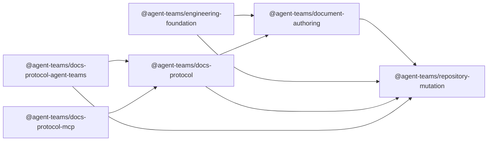

# ADR-0043: New-Only Portable Documentation Package Boundary

Status: Accepted target; implementation and qualification pending

Date: 2026-08-31

Decision owner: Product owner

## Context

ADR-0039 accepted a portable documentation workflow but kept Docs Protocol as a
modular monolith over Engineering Foundation and left the managed Agent Teams
preset in the same package placement. That placement makes portable consumers
take an organization-specific dependency path and keeps reusable mutation and
authoring mechanisms coupled to a broader tooling release.

The product owner has approved a genuinely portable, independently versioned
package boundary with one-way layers and no compatibility bridge. This decision
records the target only. The current manifests and source tree do not implement
or qualify it yet; availability must not be inferred from acceptance.

This is a scoped supersession of ADR-0039: it replaces only ADR-0039 decision 1's
package boundary and decision 5's unchanged managed placement. Repository
lifecycle metadata models whole-document supersession, so `supersedes` remains
empty and ADR-0039 remains accepted for all other decisions. In particular, its
data-only profiles, repository-owned canonical Markdown/YAML, disposable
projections, exact-preimage mutation, resource bounds, and security and failure
boundary remain normative.

## Decision

### Authoritative target dependency DAG

This is the only manually maintained target graph. `A -> B` means package A
imports package B.

The closed target edges are:

1. `@agent-teams/repository-mutation` has no dependency on another package in
   this monorepo.
2. `@agent-teams/document-authoring` has exactly one dependency on another
   package in this monorepo: Repository Mutation.
3. `@agent-teams/engineering-foundation` has exactly two monorepo package
   dependencies: Repository Mutation and Document Authoring.
4. `@agent-teams/docs-protocol` has exactly two monorepo package dependencies:
   Repository Mutation and Document Authoring.
5. `@agent-teams/docs-protocol-agent-teams` has exactly two monorepo package
   dependencies: Docs Protocol and Repository Mutation.
6. `@agent-teams/docs-protocol-mcp` imports only Docs Protocol's public API. It
   cannot import another monorepo package or a Docs Protocol private subpath.

Package manifests are the executable source-dependency authority. The graph
above fixes the accepted target; implementation gates must prove that manifests,
exports, source imports, packed artifacts, and installed resolution all agree.

### Package and authority boundaries

1. Repository Mutation owns only portable mutation mechanisms: the cooperative
   operation barrier, closed create-absent and replace-known-file operations,
   exact preimage/postimage binding, bounded journals and receipts, persisted
   evidence inspection, and exact-build recovery. It exposes no documentation
   vocabulary, managed assets, consumer callbacks, or generic plugin runtime.
2. Document Authoring owns portable authoring contracts and behavior: inert
   profile parsing, canonical catalog observation, Intent and Plan compilation,
   protected materialization through Repository Mutation, and authoring-specific
   diagnostics and recovery routing. Repository-owned Markdown/YAML remains
   canonical; catalogs, search indexes, context bundles, and other projections
   remain disposable.
3. Engineering Foundation owns reusable engineering validation, capability,
   conformance, local/registry lifecycle, and release mechanisms. It composes
   the two lower packages but does not become a production dependency or regain
   documentation-specific orchestration.
4. Docs Protocol owns the portable documentation application and public API,
   including bootstrap, catalog/search, bounded context projection, authoring,
   checking, CLI presentation, and the portable agent workflow. Consumer facts
   remain inert data, and Docs Protocol does not own organization governance.
5. Docs Protocol Agent Teams owns every Agent Teams-specific implementation,
   managed asset, managed command behavior, and Qualified Cohort integration.
   `agent-teams-docs-managed` owns its consumer policy, catalog, enrollment, and
   evidence. No managed implementation or asset remains in the portable package.
6. Docs Protocol MCP is an optional read-only transport over the Docs Protocol
   public API. It owns no catalog, profile semantics, index, mutation, recovery,
   managed integration, canonical content, daemon lifecycle, or remote mutation.

Profiles remain bounded local data. They cannot contain executable plugins,
callbacks, commands, package references, hooks, dynamic imports, environment
interpolation, remote schemas, or template engines. Consumer-specific document
types, owners, schemas, templates, placement, reachability, semantic validators,
and prose acceptance remain in the consumer repository.

### Package release concerns and consumer rollout

The source dependency graph, qualification coverage, package publication order,
and consumer rollout answer different questions and must not be collapsed into
a second graph:

- source dependencies state which package may import which package and are
  observed from classified source plus exact package manifests;
- qualification coverage states which public package and edge have packed,
  installed, adversarial, platform, recovery, and consumer evidence; coverage is
  not permission to create a source dependency;
- package publication order is computed at the exact release head by
  topologically sorting the exact internal dependencies in package manifests;
  and
- consumer rollout follows a separately approved operational plan only after
  protected publication proof. It grants no package import edge and is not a
  second package release order.

No document or release script may carry a second hand-maintained package order.
An unclassified package, ambiguous edge, missing qualification record, cycle, or
manifest/source disagreement fails before publication.

### Source-dependencies v2 acceptance

Before the target is implemented, Source Dependencies v2 must fail closed on:

1. a new or otherwise unclassified workspace package;
2. a governed source file assigned to zero boundaries or multiple boundaries;
3. one architecture boundary spanning more than one npm package;
4. a cross-package relative import;
5. an undeclared package import or an unexported/undeclared subpath import;
6. a runtime cycle or a type-only cycle between packages or boundaries; and
7. a public package without explicit qualification coverage.

These are target acceptance criteria, not claims about the current validator or
source tree. Qualification must include positive and hostile fixtures for each
failure class and prove that type-only imports cannot conceal a forbidden edge.

### New-only cutover and recovery

The cutover is direct. It creates no compatibility alias, old root export,
re-export facade, forwarding binary, `v1 -> bridge -> split` sequence, optional
adapter dependency, or runtime autodetection. Portable `agent-teams-docs` and
Docs Protocol MCP cannot import Docs Protocol Agent Teams statically,
dynamically, conditionally, or through a subprocess.

Before publication, every current consumer must be inventoried at an exact
commit. Its explicit new-only migration must exist as a reviewed, prepared but
unmerged change, including intended exact coordinates, lockfile update,
managed-adapter placement, recovery instructions, and required-check plan.
Disposable hermetic qualification of the exact packed artifacts and an approved
coordinated publication, rollout, and recovery plan must also be complete. This
preparation does not require a consumer to merge pins to versions that do not
yet exist.

After protected publication, exact registry, integrity, signature, and
source-bound provenance proof gates consumer adoption. Prepared consumer changes
then adopt exact published pins in the approved order, run each consumer's full
required checks, and prove fleet closure. New-only forbids a bridge or runtime
compatibility path; it does not make nonexistent registry versions a valid
prepublication dependency.

Retiring a legacy command or export is not permission to remove persisted
transaction support. Every recognized journal and recovery handler remains
available for its documented support window. Recovery requires the exact
recorded package version and build identity; incompatible, corrupt, ambiguous,
or rebuilt-same-version evidence is preserved and all mutation fails closed.
Published versions are immutable and are never overwritten, repaired in place,
unpublished, or replaced by moving a floating tag.

Registry mode remains reproducible and exact. Local mode remains an explicit
development action, and no local-link state, override, patch, or floating range
is committed.

## Delivery and evidence

The compact phase and evidence contract is
[Docs portable boundary delivery](../development/docs-portable-boundary-delivery.md).
Until every pending item there is proven at one exact head, this ADR describes
an accepted target rather than an implemented, qualified, installable, or
released package set.

## Consequences

- Portable mutation and authoring mechanisms can evolve without carrying
  Engineering Foundation or Agent Teams managed policy.
- Managed consumers get one direct adapter owner rather than conditional logic
  in a portable package.
- Independent versions increase qualification work, so coverage is closed-world
  and release order is derived rather than copied into documentation.
- Existing consumers must coordinate a breaking cutover; no compatibility layer
  hides an incomplete migration.
- Recovery support outlives user-facing legacy entrypoints when persisted
  in-flight evidence still requires it.

## Non-goals

- A documentation site generator, portal, visual documentation search UI, or
  hosted service.
- A universal plugin platform, consumer-executable extension system, or new
  daemon.
- Automatic prose acceptance, architecture approval, or document repair.
- Network-backed canonical documentation or a persistent authoritative index.
- Automatic consumer migration, package installation, or project mutation.

## Rejected alternatives

- Retain the Docs Protocol modular monolith and make managed behavior optional.
- Add compatibility aliases, root re-exports, or a forwarding facade.
- Let the portable CLI discover the Agent Teams adapter at runtime.
- Maintain a second release-order list beside exact package manifests.
- Treat coverage evidence as an import edge or a passing source graph as release
  qualification.
- Remove journals or recovery handlers when a legacy command disappears.
- Select a site generator, generic plugin runtime, daemon, or automatic prose
  evaluator as part of the package split.
